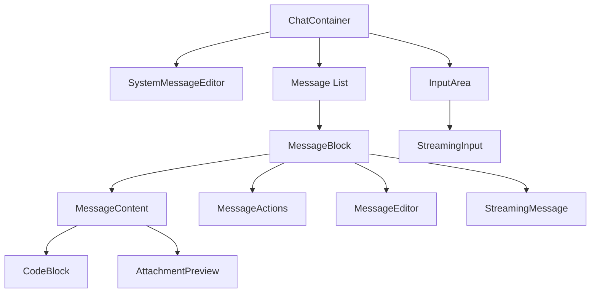

# Chat Component Architecture

## Component Overview

### Core Components

1. **ChatContainer** (`ChatContainer.tsx`)

   - Main container component that orchestrates the chat interface
   - Manages message display, input handling, and streaming state
   - Integrates with system message editor and error handling

2. **MessageBlock** (`MessageBlock.tsx`)

   - Displays individual chat messages
   - Handles message actions (edit, react, copy)
   - Integrates with UserAvatar and MessageContent

3. **MessageContent** (`MessageContent.tsx`)

   - Renders message content with Markdown support
   - Handles file attachments
   - Integrates with CodeBlock for code syntax highlighting

4. **InputArea** (`InputArea.tsx`)
   - Handles user input and file attachments
   - Manages textarea auto-resizing
   - Provides action buttons for sending/canceling messages

### Specialized Components

1. **CodeBlock** (`CodeBlock.tsx`)

   - Advanced code display with syntax highlighting
   - Supports code execution for Python and HTML
   - Provides copy and edit functionality

2. **SystemMessageEditor** (`SystemMessageEditor.tsx`)

   - Manages system messages for conversations
   - Provides popover interface for editing
   - Integrates with chat store for persistence

3. **Streaming Components**
   - **StreamingInput**: Manages input state during streaming
   - **StreamingMessage**: Handles message display during streaming

### Utility Components

1. **MessageActions** (`MessageActions.tsx`)

   - Provides action buttons for messages
   - Handles edit, react, and copy functionality

2. **MessageEditor** (`MessageEditor.tsx`)
   - Provides interface for editing messages
   - Handles keyboard shortcuts
   - Manages content validation

## State Management

### Chat Hook (`useChat.ts`)

- Central hook for chat functionality
- Manages message and conversation state
- Handles message editing and streaming
- Provides conversation management functions

### Store Integration

- Uses Zustand for global state management
- Handles optimistic updates
- Manages conversation persistence
- Coordinates with backend through Tauri commands

## Component Relationships



## Improvement Suggestions

1. **Component Organization**

   ```
   src/components/chat/
   ├── core/
   │   ├── ChatContainer.tsx
   │   ├── MessageBlock.tsx
   │   └── InputArea.tsx
   ├── content/
   │   ├── MessageContent.tsx
   │   ├── CodeBlock.tsx
   │   └── AttachmentPreview.tsx
   ├── actions/
   │   ├── MessageActions.tsx
   │   └── MessageEditor.tsx
   ├── streaming/
   │   ├── StreamingInput.tsx
   │   └── StreamingMessage.tsx
   ├── system/
   │   └── SystemMessageEditor.tsx
   ├── hooks/
   │   ├── useChat.ts
   │   └── useScrollHandler.ts
   └── utils/
       └── messageUtils.ts
   ```

2. **Type Improvements**

   - Create dedicated type files for each component group
   - Use stricter typing for message content
   - Add proper error types

3. **State Management**

   - Separate conversation and message stores
   - Add proper loading states
   - Improve error handling
   - Add proper TypeScript types for store

4. **Performance Optimizations**

   - Implement proper memo usage
   - Add virtualization for long message lists
   - Optimize re-renders
   - Add proper loading states

5. **Testing**

   - Add unit tests for components
   - Add integration tests for chat flow
   - Add proper mocking for Tauri commands
   - Test error scenarios

6. **Accessibility**
   - Add proper ARIA labels
   - Improve keyboard navigation
   - Add proper focus management
   - Test with screen readers

## Usage Examples

### Basic Chat Container

```tsx
import { ChatContainer } from "./components/chat";

function App() {
  return (
    <div className="h-screen">
      <ChatContainer />
    </div>
  );
}
```

### Custom Message Display

```tsx
import { MessageBlock, MessageContent } from "./components/chat";

function CustomMessage({ message }) {
  return (
    <MessageBlock
      message={message}
      onReact={(id) => console.log(`React to message ${id}`)}
      onEdit={(id, content) => console.log(`Edit message ${id}: ${content}`)}
    >
      <MessageContent message={message} />
    </MessageBlock>
  );
}
```

### Custom Input Area

```tsx
import { InputArea } from "./components/chat";

function CustomInput() {
  const handleSend = async (content, attachments) => {
    console.log("Sending message:", content, attachments);
  };

  return (
    <InputArea onSend={handleSend} isStreaming={false} isCancellable={false} />
  );
}
```

## Development Guidelines

1. **Component Creation**

   - Use TypeScript for all new components
   - Add proper JSDoc documentation
   - Include usage examples
   - Add proper prop types

2. **State Management**

   - Use hooks for component state
   - Use store for global state
   - Handle loading and error states
   - Use proper TypeScript types

3. **Styling**

   - Use Tailwind for styling
   - Follow theme system
   - Make components responsive
   - Add proper transitions

4. **Testing**
   - Write tests for new components
   - Test error scenarios
   - Test accessibility
   - Test performance
